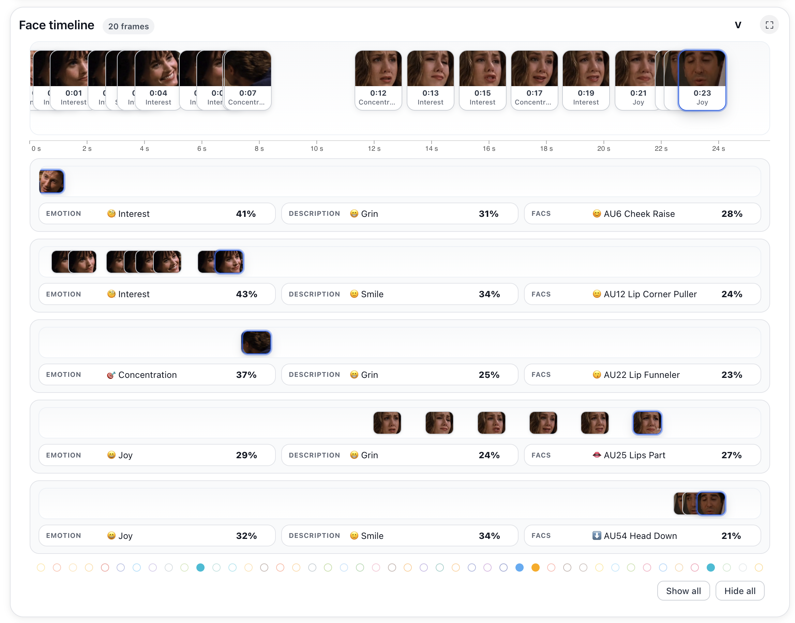
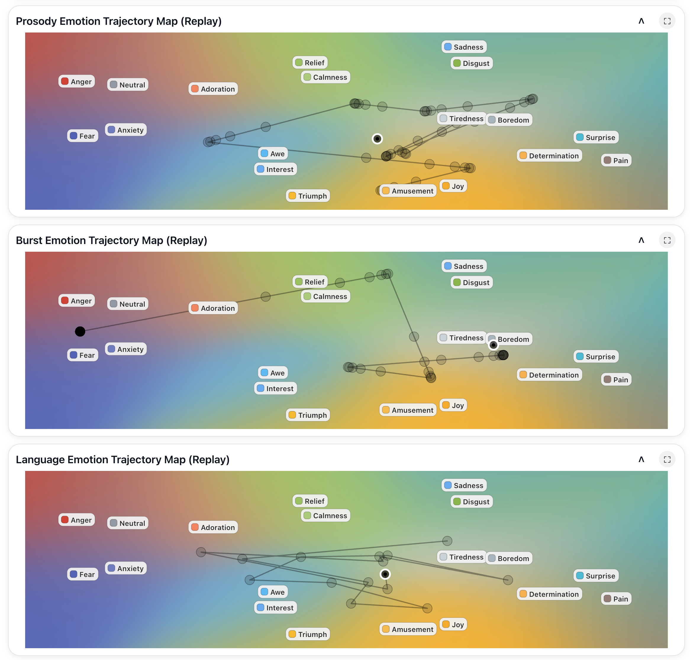
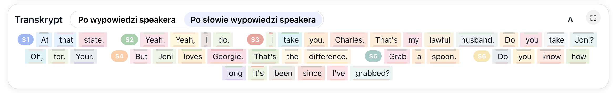
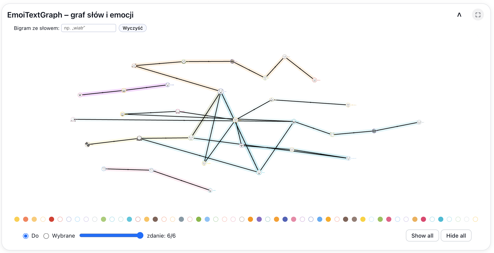

# EmoLab

## Interactive Multimodal Affective Analysis and Synchronized Replay

<p align="center">
  <strong>
    A research environment for synchronized inspection, replay, and interpretation
    of multimodal affect-related telemetry.
  </strong>
</p>

<p align="center">
  <em>Speech · Language · Prosody · Vocal Events · Speakers · Faces · Timelines · Replay · Affective-Cognitive Interpretation · Reporting</em>
</p>

---

## Overview

EmoLab is an interactive research environment for inspecting multimodal affect-related information within a shared temporal representation.

Affective-computing systems often generate separate outputs for speech recognition, speaker turns, linguistic content, prosody, vocal events, facial behaviour, and temporal interaction structure. These outputs may use different time scales, identifiers, segmentation strategies, and data formats, making them difficult to interpret together.

EmoLab organizes heterogeneous model outputs into persistent, replayable sessions. Source audio or video, transcript words, speaker information, facial observations, affect-related predictions, timelines, graphs, trajectory maps, and structured interpretations can be inspected in synchrony.

The system is designed to support research, qualitative model inspection, multimodal error analysis, education, and investigation of agreement, disagreement, uncertainty, provenance, and temporal dynamics across affective-computing models.

> EmoLab does not claim to reveal a person's true internal emotional state.  
> It provides an auditable environment for inspecting model-generated predictions and higher-level hypotheses in their temporal and multimodal context.

---

## Research Motivation

Multimodal affect analysis introduces an interpretation problem.

A researcher may have access to:

* source audio or video;
* speech-recognition output;
* word and utterance timestamps;
* speaker segmentation;
* prosodic predictions;
* linguistic predictions;
* vocal-event predictions;
* facial observations;
* model-specific temporal windows;
* session-level summaries.

However, these outputs are commonly distributed across separate files, APIs, logs, media players, and visualization tools.

This makes it difficult to answer basic questions:

* Which word was spoken when a prosodic prediction changed?
* Which speaker was active at that moment?
* Which face was visible?
* Did linguistic, vocal, and facial outputs agree?
* Can the same moment be reconstructed later?
* Can preserved model outputs still be inspected when the original inference service is no longer available?

EmoLab addresses this problem through synchronized session representation and deterministic replay.

---

## Core Capabilities

### Synchronized audiovisual replay

Audio or video playback is linked to transcript highlighting, speaker information, facial observations, timelines, and model-generated affective outputs.

### Shared temporal representation

Events generated at different levels of granularity—frames, words, utterances, speaker turns, facial observations, and model-specific windows—are mapped to a common timeline.

### Transcript and speaker inspection

Words, utterances, speaker runs, and temporal speech information can be inspected together with corresponding audiovisual and affect-related events.

### Multimodal timeline navigation

Users can pause, seek, replay, and move between high-level visualizations and the corresponding moment in the source interaction.

### Facial and behavioural inspection

Facial observations and face-oriented timelines can be examined together with speech, speaker, prosodic, and linguistic information.

### Responsive card-based interface

EmoLab uses a responsive, vertically structured card layout designed for both desktop and mobile inspection workflows.

Analytical cards can be:

- expanded or collapsed;
- inspected independently;
- opened in full-screen mode;
- arranged into task-specific inspection sequences;
- used without requiring every visualization to remain visible simultaneously.

The vertical layout is intentional: it supports progressive inspection of complex sessions on screens of different sizes while preserving access to specialized views.

### Persistent session bundles

EmoLab preserves timing metadata and previously generated model outputs in reloadable sessions, supporting later inspection without repeating the original analysis.

### Affective-cognitive interpretation

EmoLab includes an affective-cognitive agent that converts selected synchronized telemetry into a structured analytical report.

The agent can organize evidence into:

- affective background;
- temporal phases;
- turning points;
- cross-channel conflicts;
- confidence-qualified working hypotheses;
- unknowns and indeterminacies;
- evidence-grounding and temporal-audit notes.

The report distinguishes observed model outputs from higher-level interpretation. Its conclusions are hypotheses for critical human review, not statements of psychological fact.

### Session-level reporting

Interactive visualizations and structured summaries support qualitative analysis, interpretation, and documentation of multimodal sessions.

---

## Demonstration Workflow

```text
Recorded audiovisual interaction
                │
                ▼
Previously generated multimodal telemetry
                │
                ▼
Persistent EmoLab session bundle
                │
                ▼
Shared temporal representation
                │
                ▼
Synchronized replay and inspection
                │
                ▼
Cross-modal comparison and conflict analysis
                │
                ▼
Affective-cognitive interpretation and reporting
```

The proposed demonstration uses a short, previously analysed dyadic audiovisual session.

During the demonstration, the presenter:

1. opens a locally stored EmoLab session;
2. plays the original audiovisual interaction;
3. shows the synchronized transcript and speaker information;
4. navigates to an affectively relevant moment;
5. compares linguistic, prosodic, vocal, and facial outputs;
6. examines cross-modal agreement or disagreement;
7. demonstrates deterministic replay and interactive timeline navigation;
8. presents an evidence-aware affective-cognitive interpretation;
9. identifies hypotheses, confidence levels, and unresolved unknowns.

The objective is not to identify the “correct emotion.” The objective is to make the behaviour, provenance, timing, uncertainty, and limitations of multimodal model outputs inspectable.

---

## Affective-Cognitive Interpretation

The affective-cognitive agent is a central interpretation component of EmoLab.

It transforms selected synchronized telemetry into a structured report that can describe:

- the recent affective background;
- phase transitions across the session;
- candidate turning points and leading indicators;
- conflicts between language, prosody, vocal events, and other channels;
- working hypotheses with explicit confidence levels;
- unknowns that cannot be resolved from the available evidence;
- whether claims are temporally grounded or based only on global summaries.

The agent is designed to preserve an explicit distinction between:

```text
observed model output
        ↓
cross-channel evidence
        ↓
interpretive hypothesis
        ↓
confidence and uncertainty
        ↓
human review
```

This design makes the report inspectable and challengeable rather than presenting generated interpretation as unquestionable fact.

See [Affective-Cognitive Agent](docs/affective-cognitive-agent.md).

---

## Selected System Views

The screenshots below present complementary parts of the EmoLab inspection workflow. Each view is connected to the same temporally structured session representation.

### Face Timeline and Track-Oriented Inspection



The face timeline organizes selected facial observations along the shared session time axis and groups them by tracked face. It supports inspection of temporally positioned face crops, model-predicted facial affect, facial descriptions, Facial Action Coding System information, confidence values, and correspondence with the underlying audiovisual interaction.

---

### Multimodal Emotion Trajectory Maps



The trajectory maps present modality-specific affect-related paths for prosody, vocal bursts, and language. Connected points expose temporal movement, local stability, and changes in model-generated affective representations.

---

### Speaker-Diarized Transcript



The transcript view groups words into speaker-attributed utterances and preserves their temporal relationship to the replay session. It supports speaker diarization, word-level timing, affect-related colour layers, and navigation between transcript content and replay position.

---

### EmoiTextGraph — Word and Emotion Relations



EmoiTextGraph provides an interactive graph representation of transcript words and associated affect-related information. It supports sentence-based exploration, word-to-word relationships, emotion-coloured paths, bigram filtering, and inspection of selected or cumulative transcript fragments.

---

For additional views—including area timelines, Emotion Pulses, Top-5 summaries, sparklines, and the complete vertical interface—see:

- [System Gallery](docs/system-gallery.md)
- [Full Interface Overview](docs/full-interface-overview.md)

---

## Demonstration Reliability

The prepared demonstration can run from a locally stored session bundle.

The main demonstration workflow is designed to remain operational without depending on conference Wi-Fi or the continued availability of the original external inference service.

A prerecorded demonstration video will also be available as a fallback.

---

## Intended Users

EmoLab is designed for:

* affective-computing researchers;
* multimodal-interaction researchers;
* human-computer interaction researchers;
* speech and social-signal-processing researchers;
* developers performing qualitative model inspection;
* researchers analysing temporal alignment and model disagreement;
* educators demonstrating the opportunities and limitations of automated affect inference.

---

## Ethics and Limitations

EmoLab displays probabilistic outputs generated by computational models.

These outputs may be:

* uncertain;
* culturally dependent;
* affected by dataset and model bias;
* inconsistent across modalities;
* sensitive to recording conditions;
* unsuitable for interpretation as direct measurements of internal emotional states.

EmoLab is not a diagnostic system.

It should not be used for consequential decisions concerning:

* health;
* employment;
* credibility;
* personality;
* psychological condition;
* access to services;
* legal or disciplinary outcomes.

Conference attendees will not be covertly recorded or analysed. Any optional live interaction would require explicit prior consent.

See [Ethics and Limitations](docs/ethics-and-limitations.md).

---

## Technical Requirements

The prepared demonstration requires only:

* one laptop;
* one standard table or demo desk;
* one power outlet;
* locally stored demonstration material;
* headphones.

An external monitor is useful but optional.

The main demonstration does not require special network configuration, dedicated servers, unusual lighting, or specialized installation infrastructure.

See [Technical Requirements](docs/technical-requirements.md).

---

## Demo Video

A short demonstration video is currently being prepared.

The video will show:

* synchronized audiovisual replay;
* transcript and speaker inspection;
* multimodal timeline navigation;
* facial observations;
* cross-modal comparison;
* session-level interpretation.

The public video link will be added here when available.

---

## Project Status

EmoLab is an active research prototype.

The current public repository provides:

* project documentation;
* demonstration materials;
* screenshots;
* technical requirements;
* ethical and methodological information;
* links to public videos and publications.

The source code is not publicly released at this stage.

No source-code license is granted through this repository.

---

## Documentation

* [System Overview](docs/system-overview.md)
* [System Gallery](docs/system-gallery.md)
* [Full Interface Overview](docs/full-interface-overview.md)
* [Affective-Cognitive Agent](docs/affective-cognitive-agent.md)
* [Technical Requirements](docs/technical-requirements.md)
* [Ethics and Limitations](docs/ethics-and-limitations.md)
* [Demo Video Information](video/README.md)

---

## Citation

Citation metadata is provided in [`CITATION.cff`](CITATION.cff).

Until a formal publication is available, the project may be referenced as:

> Pawel Borowiec, “EmoLab: Interactive Multimodal Affective Analysis and Synchronized Replay,” research prototype, 2026.

---

## Author

**Pawel Borowiec**  
Independent Researcher

---

## Availability and Rights

Copyright © 2026 Pawel Borowiec.

All rights reserved.

The materials in this repository are provided for project description, academic review, research communication, and demonstration purposes.

See [`LICENSE.md`](LICENSE.md) for details.
