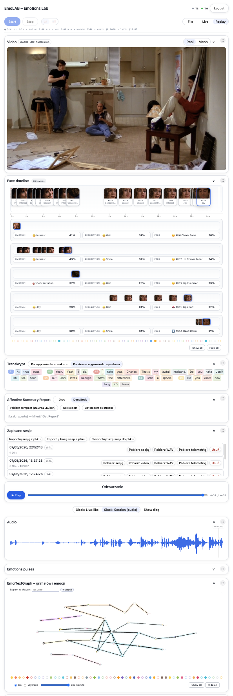
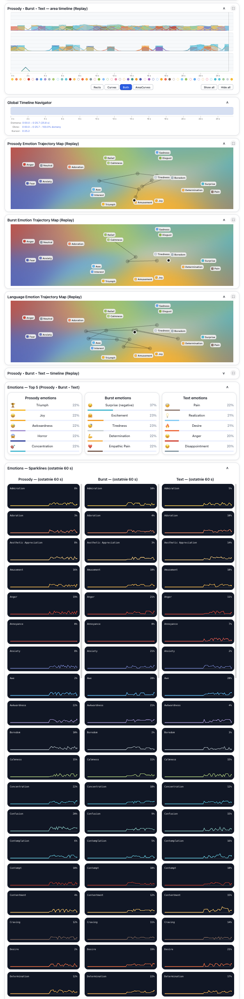

# EmoLab Full Interface Overview

## 1. Responsive Vertical Architecture

EmoLab uses a responsive, vertically structured card interface designed for desktop, laptop, and mobile inspection workflows.

The interface can contain many analytical views without requiring all of them to be active or visible at the same time.

Cards can be expanded, collapsed, opened in full-screen mode, inspected independently, and combined into task-specific sequences.

---

## 2. Upper Interface



The upper section may include:

- application and mode controls;
- source video;
- face timeline;
- speaker-diarized transcript;
- affective summary report controls;
- saved-session management;
- replay controls;
- waveform;
- Emotion Pulses;
- EmoiTextGraph.

---

## 3. Lower Interface



The lower section may include:

- multimodal area timelines;
- global timeline navigation;
- prosody, burst, and language trajectory maps;
- additional timeline variants;
- Top-5 emotion summaries;
- emotion sparklines.

---

## 4. Full-Screen Inspection

Individual analytical cards can be opened in full-screen mode. This supports close inspection during research, clearer presentation during demonstrations, and focused interaction on mobile devices.

---

## 5. Progressive Inspection

```text
video / audio
      ↓
transcript and speakers
      ↓
face and temporal observations
      ↓
timelines, graphs, and trajectories
      ↓
cross-modal comparison
      ↓
affective-cognitive interpretation
```

The user does not need to inspect every card during every session.
