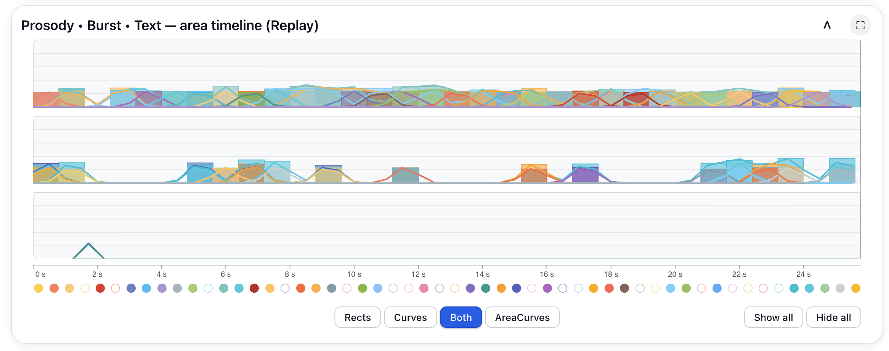
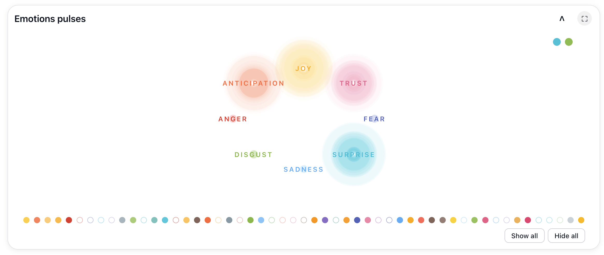
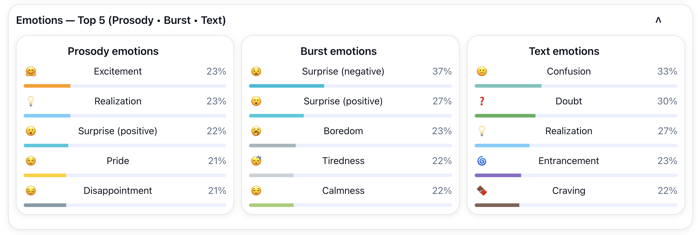
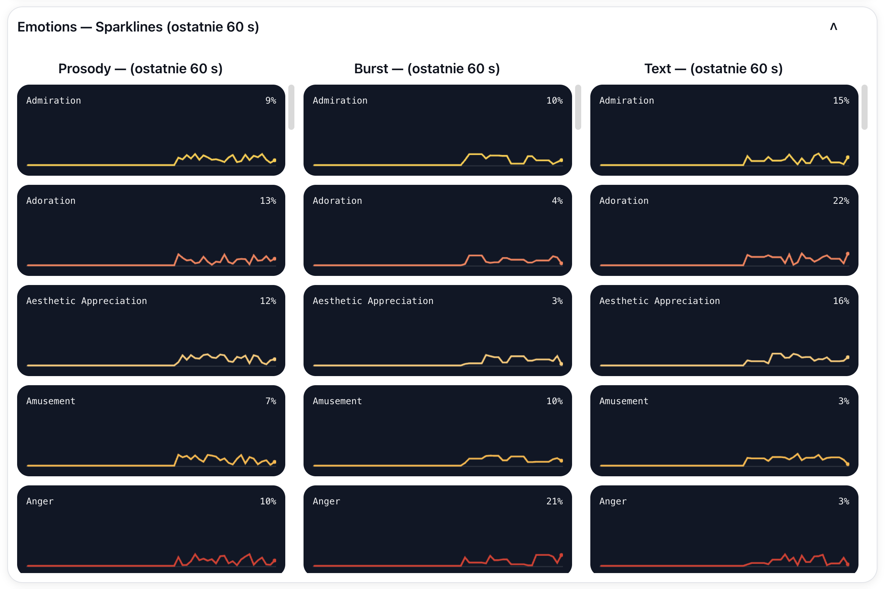

# EmoLab System Gallery

This gallery presents selected analytical views from the EmoLab research prototype.

All views are connected to persistent, temporally structured sessions and are intended for qualitative inspection of multimodal model outputs.

---

## Face Timeline and Track-Oriented Inspection

The face timeline aligns selected face crops to the session time axis and groups them by tracked face. It can display model-predicted facial affect, facial descriptions, Facial Action Units, confidence values, and correspondence with the source video.

---

## Speaker-Diarized Transcript

The transcript view groups words into speaker-attributed utterances and links them to replay time and affect-related colour layers.

---

## Multimodal Emotion Trajectory Maps

Separate trajectory maps for prosody, vocal bursts, and language show temporal movement through an emotion-oriented visual landscape.

---

## Prosody, Burst, and Text Area Timeline

The area timeline presents temporally aligned affect-related outputs across modalities and supports rectangular, curved, and combined representations.

---

## EmoiTextGraph

EmoiTextGraph represents transcript words and affect-related relationships as an interactive graph. It supports sentence-based exploration, bigram filtering, cumulative views, and emotion-coloured paths.

---

## Emotion Pulses

Emotion Pulses provides a high-level summary using Plutchik-oriented clusters.

---

## Top-5 Emotion Summaries

The Top-5 view compares dominant model outputs for prosody, vocal bursts, and text.

---

## Emotion Sparklines

Sparklines provide compact temporal traces for many affect-related dimensions across modalities.

---

## Full Interface

See the [Full Interface Overview](full-interface-overview.md).

## Interpretation Layer

See the [Affective-Cognitive Agent](affective-cognitive-agent.md).
